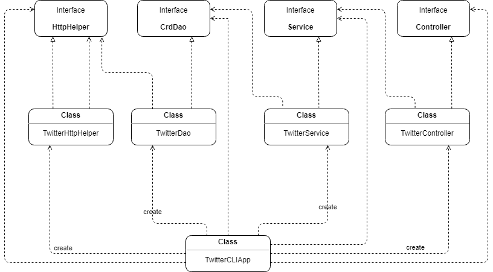

# Twitter CRD Application
- [Introduction](#introduction)
- [Quick Start](#quick-start)
- [Design](#design)
    - [UML diagram](#uml-diagram)
    - [Models](#models)
    - [Spring](#spring)
- [Test](#test)
- [Deployment](#deployment)
- [Improvements](#improvements)

# Introduction

The Twitter CRD App was implemented to post(create), show (read) and delete Twitter posts via Twitter REST API from CLI.
The app requires Twitter API keys and tokens acquired from the Twitter Developer account.
The project was build with a Model-View design pattern. It includes the following components:
* Models 
* Controller layer
* Service layer
* Data Access Layer (DAO)

The application was developed and testes with Java 8, Maven, Twitter REST API, HTTP & JSON,
Spring, Junit and Mockito.
It was also Dockerized and the image was uploaded to Docker Hub (**olensa/twitter**).

# Quick Start

You need 4 keys/tokens obtained from the Twitter Developer account.
Create the following environmental variables and export them to the app:
```
consumerKey: API Key
consumerSecret: API Secret
accessToken: Access Token
tokenSecret: Access Secret
```
You can start using the application using two approaches:
1. Using `.jar` file. Make sure you have [Maven](https://maven.apache.org/download.cgi) downloaded and installed.
```
# Compile and package the app
mvn clean package

# Launch JVM and run the app
java -jar target/twitter-1.0-SNAPSHOT.jar post|show|delete [options]
```
2. Using Docker. Make sure you have [Docker](https://docs.docker.com/get-docker/) downloaded and installed.
```
# pull Docker image from Docker Hub
docker pull olensa/twitter

# run the container
docker run --rm \
-e consumerKey=YOUR_VALUE \
-e consumerSecret=YOUR_VALUE \
-e accessToken=YOUR_VALUE \
-e tokenSecret=YOUR_VALUE \
olensa/twitter post|show|delete [options]
```

After you installed the app you can do one of the following actions:
* POST tweet with geo coordinates

    `TwitterApp post tweet_text longitude:latitude`

* SHOW tweet by ID
    
    `TwitterApp show tweet_id [field1,field2...]`

* DELETE tweet(s) by id(s)
    
    `TwitterApp show tweet_id [field1,field2...]`


# Design

## UML diagram




**App**

```TwitterCLIApp```
Receives the environmental variables from the system(Twitter keys and tokens) and passes them to the app.
Then it takes the user input from Linux CLI and calls the post|show|delete methods from the Controller layer. 


**Controller**

```TwitterController```
Takes the user input and parses it to verify the correct number of arguments and their format.
Then it calls the methods in the service layer (post|show|delete).

**Service**

```TwitterService```

Implements business logic of the application and calls DAO layer
to interact with Twitter REST API. 
1. When posting a tweet, the layer checks if the text exceeds 280 characters 
and if coordinates are out of range. Longitude (-180:180); latitude (-90:90).
2. When searching/deleting, the layer checks if user IDs are in a correct format.

**DAO**

```TwitterDao```

Handles class private member variables (models implemented with POJOs). 
There are 5 models created: Coordinates, Entities, Hashtag, Tweet, UserMention. 
This layer save|show|delete tweet(s) and <u>doesn't</u> check any business logic of the app.
It handles HTTP requests and responses using ```TwitterHttpHelper``` and URIs to execute the commands.

## Models

A simplified version of a Twitter model was implemented, which included 5 classes:


## Spring

To solve the Dependency Management problem and avoid manual setup of components/dependencies,
Spring framework was used. 
The `TwitterCLIApp` calls the inner layers and requires the proper dependencies. Using
`@Component`, `@Controller`, `@Service` and `@Repository` in the layers themselves,
we marked them as Beans in the `TwitterCLISpringBoot` to replace the traditional
`main` approach. They were lately processed by 
`TwitterCLIComponentScan` to scan through the app package and receive the correct configuration.


# Test

The Twitter App was tested on Linux CentOS 7 (running on GCP's virtual machine).
Each layer of the app was tested, catching the exceptions.

**JUnit 4** was used to control test class workflow with annotations. 
JUnit required the exported environmental variables (Twitter keys and tokens).
For each tested class method, Assertions were used to test, 
if the actual result of the method is what we expect or not. 

**Mockito** framework was used to test a class but not the dependencies. Mockito created a *mock objects* 
(dummy implementations) of our classes. Mockito did not require Twitter keys and tokens.
So it helped us to test classes functionality in a 'closed environment' 
without even using the relations between classes.

Tests were designed to verify the correct work of the post|show|delete methods (on different layers)
and the results were checked manually (by reviewing the Twitter page) and automatically 
(by reviewing the tests' output in IntelliJ IDE).


# Deployment

The Twitter app was deployed by creating a Docker image and pushing it to the Docker Hub for easier distribution.
The image is available to download from my [Docker Hub](https://hub.docker.com/repository/docker/olensa/twitter) 
or manually from CLI `docker pull olensa/twitter`.

# Improvements

* Add more Twitter functionality (like a tweet by ID, retweet, filter/search by a hashtag)
* Automate posting (let the app create and post tweets based on a preset schedule)
* Notify the user if his/her tweets were liked/retweeted/commented
