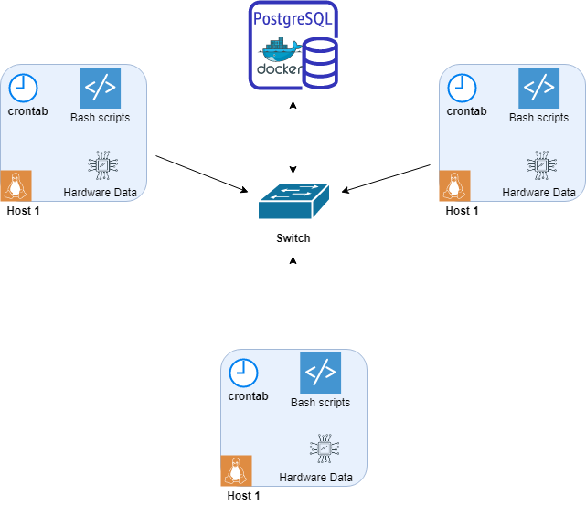

#Linux Cluster Monitoring Agent
- [Introduction](#introduction)
- [Quick Start](#quick-start)
- [Implementation](#implementation)
    - [Architecture](#architecture)
    - [Scripts](#scripts)
    - [Database Modeling](#database-modeling)
- [Test](#test)
- [Deployment](#deployment)
- [Improvements](#improvements)

# Introduction


The Linux Cluster Monitoring Agent (LCMA) was designed as a tool for Linux Cluster Administrator(LCA) team to record information about servers(computers) in the network.
These servers are connected in a Linux cluster through internal IPv4 addresses. The cluster is running on Centos7. The LCMA will collect the host's hardware specifications as well as resource usage statically and dynamically.
The collected data will be used to generate useful reports for future purposes (add/remove servers, check for hardware failures, data analysis).
The script will record the host's number of CPUs, its architecture and model, CPU's MHz, the amount of total and free memory number of disk I/O and more.
The data will be stored in a Postgresql Docker database (RDBMS) every minute using crontab. This script is using PSQL, Docker, Bash and other supporting technologies (Git, Google Cloud Platform, Linux CentOS 7, DBeaver).
# Quick Start


Currently, LCMA quick start was tested on Linux CentOS 7 (running on GCP's virtual machine) with pre-installed Docker Postgres image.
[Install Docker on CentOS 7](https://docs.docker.com/engine/install/centos/). [Download Postgres image on Docker](https://hub.docker.com/_/postgres).
1. Start a psql instance using `psql_docker.sh` script.
```bash
# You have to make sure that the PSQL Docker container was created. If not:
./scripts/psql_docker.sh create [psql_username] [psql_password]

# Start/stop the container:
./scripts/psql_docker.sh [start | stop]
```
2. Create host_info and host_usage tables that will store the data with `ddl.sql` script.
```bash
# Run the script specifying -h hostname, -U username and -d name of the database. -f for the filename.
psql -h psql_host -U psql_username -d db_name -f sql/ddl.sql
```
3. Insert host's hardware specs into the database, created in the previous step with `host_info.sh`. 
```bash
# Make sure to provide proper psql hostname, psql port (5432 by default), name of the database, psql username and psql password
./scripts/host_info.sh psql_host psql_port db_name psql_username psql_password
```
4. Insert host's usage data into the database, created in step 2 with `host_usage.sh`.
```bash
# Make sure to provide proper input variables (the same as for host_info in step 4)
./scripts/host_usage.sh psql_host psql_port db_name psql_username psql_password
```
5. Set up the automation of `host_usage.sh` with crontab. The script will collect the data and add it to the database every minute.
```bash
# Open crontab editor from the command line
crontab -e
  
# Add the crontab instructions to the editor and save it to the crontab logs
* * * * * ./<PATH>/host_usage.sh psql_host psql_port db_name psql_username psql_password > /tmp/host_usage.log

#list crontab jobs
crontab -l
```
6. You are all set and can check the collected specifications. 
   You can run `queries.sql` to start your data analysis 
```bash
psql -h psql_host -U psql_username -d db_name -f sql/queries.sql
```
# Implementation


There are 3 shell scripts used in this project: `psql_docker.sh`, `host_info.sh`, `host_usage.sh` 
there are 2 extra postgresql files made use for the database management: `ddl.sql`, `querries.sql`
## Architecture


The diagram illustrates the architecture of Linux cluster with 3 hosts/servers. 
Bash Scripts collect hardware data, and then store in into the psql instance running on Docker.
* `host_info.sh` runs only ones and gathers host hardware. 
Stores the data in the database 
* `host_usage.sh` will be called every minute by `crontab` and will gather current host CPU and Memory usage. 
Stores the data in the database.
  <br/><br />


## Scripts


Shell scripts are implemented as follows:
* `psql_docker.sh` <br/>Create/start/stop a PSQL instance:<br />
    ```bash 
    bash scripts/psql_docker.sh [start | stop | create] [psql_username] [psql_password]
    ```
* `host_info.sh` <br/>Collect server's hardware data and insert it into PSQL instance. 
It will collect the hostname, cpu_number, cpu_architecture, cpu_model, cpu_mhz, l2_cache, total_memory, and timestamp.
  <br />
    ```bash
    bash scripts/host_info.sh psql_host psql_port db_name psql_username psql_password
  ```
* `host_usage.sh`
<br/>Collects server data usage information and inserts it into PSQL instance.
  It will collect the timestamp, hostname (is a foreign key to host_info), amount of unused memory, cpu_idle, cpu_kernel, disk_io and disk_available.
  <br />
    ```bash
    bash scripts/host_usage.sh psql_host psql_port db_name psql_username psql_password
  ```
* `crontab`
  <br/>Manages `host_usage.sh` to be executed every minute, 
so server's information will be stored dynamically into the database<br />
* `ddl.sql`
  <br/>Will create host_info and host_usage tables in the database (if they don't exist there yet)<br />
    ```bash
    psql -h psql_host -U psql_username -d psql_db -f sql/ddl.sql 
    ```
* `querries.sql`
  <br/>Contains the collection of SQL queries, which can be used for data analysis, including:<br />
  * List of hosts and their memory size grouped by CPU
  * Average amount of memory used by each host in the 5-minutes interval
  * Host failure detection Linux CentOS 7 (running on GCP).<br/><br />
  ``` bash 
  psql -h psql_host -U psql_user -d psql_db -f sql/queries.sql
  ```
## Database Modeling


The database consists of 2 tables. 
Host_info stores hardware specifications and host_usage, which contains CPU and memory usage data.
* `host_info` table schema 

Attribute  | Data Type | Constraint | Description
----------|-----------|---------|------------
`id`|`SERIAL`| `PK` | Psql database auto-increment
`hostname` | `VARCHAR` | `UNIQUE` | Host computer name.
`cpu_number`|`INTEGER`| `NOT NULL` |Number of CPUs on the host computer.
`cpu_architecture`|`VARCHAR`|`NOT NULL` | CPU architecture.
`cpu_model`|`VARCHAR`|`NOT NULL` | CPU processor.
`cpu_mhz`|`FLOAT`|`NOT NULL` | CPU speed (MHz).
`L2_cache`|`INTEGER`|`NOT NULL` |L2 cache size (kB).
`total_mem`|`INTEGER`|`NOT NULL` |Total memory on the host computer (kB).
`timestamp`|`TIMESTAMP`|`NOT NULL` |The time of data entry in UTC time zone.

* `host_usage` table schema

Attribute  | Data Type | Constraint | Description
----------|-----------|---------|------------
`timestamp`|`TIMESTAMP`|`NOT NULL`| The time of data entry in UTC time zone.
`host_id`|`SERIAL`|`FK` | Referencing `id` attribute from `host_info`.
`memory_free`|`INTEGER`|`NOT NULL` |Total host unused memory (kB).
`cpu_idle`|`FLOAT`|`NOT NULL` |CPU processor idle time (%).
`cpu_kernel`|`FLOAT`|`NOT NULL` |CPU kernel run time (%).
`disk_io`|`INTEGER`|`NOT NULL` |Number of disk I/O.
`disk_available`|`INTEGER`|`NOT NULL` |Total available disk space (mB).
# Test


The LCMA scripts were tested on CentOS 7 Google Cloud Platform Virtual Machine, connected via SSH. 
To achieve valid testing results, the bash scripts were executed with valid and invalid CLI arguments.
To test SQL queries, was used SQL client software application - DBeaver.
# Deployment


To develop the LCMA the following steps were followed:
* Set up Jarvis Remote Desktop (JRD) by creating VM instance on GCP (Google Cloud Platform) and installing there Linux CentOS 7
* Download and install Docker
* Download and install PostgreSQL using Docker
* Used DBeaver app for queries
* Followed GitFlow branching model for better workflow organization
# Improvements


* The `host_usage.sh` can be set up to start execute automatically (e.g. when the computer/server turns on) 
* Some Database backup might be needed.
* Add another script, which will delete the old/unnecessary data (for servers that are not in use anymore)
* For analysis purpose, more tables/gathered information can be added to the LCMA